# LearningSteps Lockdown — AWS Edition


-blue)

An end-to-end Zero Trust hardening of the **LearningSteps API**, rebuilt on **AWS** as a direct architectural translation of [`learningsteps-lockdown`](https://github.com/VladvonTranssylvanien/learningsteps-lockdown), a five-day Azure security hardening project. Same application, same threat model, same five days of objectives — different cloud, different primitives, and a real multi-cloud comparison to show for it.

Everything below was built and tested live, with actual attacks generated, actual traffic blocked, and actual data recovered — not just configured and assumed to work.

---

## Table of Contents

- [Architecture](#architecture)
- [Azure → AWS: Service Mapping](#azure--aws-service-mapping)
- [Zero-Cost Design Decisions](#zero-cost-design-decisions)
- [Day 1 — Management Access](#day-1--management-access)
- [Day 2 — TLS & WAF](#day-2--tls--waf)
- [Day 3 — Identity](#day-3--identity)
- [Day 4 — Data Isolation](#day-4--data-isolation)
- [Day 5 — Monitoring & Incident Response](#day-5--monitoring--incident-response)
- [Beyond the Requirements](#beyond-the-requirements)
- [Key Architectural Differences from Azure](#key-architectural-differences-from-azure)
- [Repository Structure](#repository-structure)
- [Deploying This Yourself](#deploying-this-yourself)
- [Tearing It Down](#tearing-it-down)

---

## Architecture

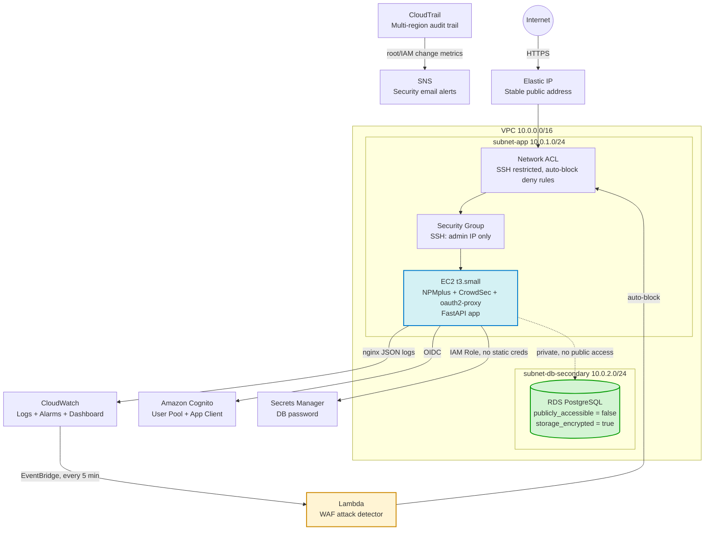

---

## Azure → AWS: Service Mapping

| Concept | Azure (original) | AWS (this project) |
|---|---|---|
| Compute | Azure VM (Standard_D2s_v3) | EC2 (t3.small) |
| Network | Azure VNet + NSG | VPC + Security Group + Network ACL |
| Keyless management access | Entra ID (`AADSSHLoginForLinux`) | IAM Role + SSM Session Manager |
| Reverse proxy / WAF | NPMplus + CrowdSec | NPMplus + CrowdSec (identical, self-hosted on either cloud) |
| Identity provider | Microsoft Entra ID (App Registration) | Amazon Cognito (User Pool + App Client) |
| Database | Azure PostgreSQL Flexible Server | Amazon RDS for PostgreSQL |
| DB network isolation | VNet Integration (forces destroy/recreate) | `publicly_accessible = false` (in-place update, **no data loss**) |
| Secrets | Azure Key Vault + Managed Identity | AWS Secrets Manager + IAM Role |
| SIEM / detection | Microsoft Sentinel + KQL | CloudWatch Logs Insights + Lambda |
| Automated response | Logic App playbook | Lambda + boto3 |
| Audit trail | Azure Activity Log | AWS CloudTrail (multi-region) |
| Alerting | Sentinel Automation Rule | CloudWatch Alarms + SNS |
| Public DNS for TLS | `domain_name_label` (free Azure FQDN) | `nip.io` (free wildcard DNS, since AWS gives no free FQDN) |
| Stable public IP | Static Public IP | Elastic IP |

---

## Zero-Cost Design Decisions

This project runs entirely on **AWS Free Plan**, which structurally cannot incur real charges (attempting to exceed free-tier services requires an explicit upgrade to a Paid Plan, which was never done). Every choice below was made to stay inside that boundary:

- **`nip.io` instead of a paid domain** — AWS gives no free FQDN for EC2 the way Azure's `domain_name_label` does. `nip.io` resolves `<ip>.nip.io` to `<ip>` automatically, letting Let's Encrypt issue a real, trusted certificate with zero cost and zero DNS setup.
- **No NAT Gateway** — the single largest hidden cost trap in AWS (~$0.045/hr + data). Avoided entirely by keeping the app in a public subnet with a tight Security Group, rather than routing through a NAT.
- **RDS storage capped at 20GB** — the Azure original used 32GB; RDS Free Tier only covers 20GB, so storage was reduced accordingly (documented trade-off, not a mistake).
- **No AWS WAF (managed)** — AWS WAF is billed per Web ACL + per rule + per request. Used CrowdSec (self-hosted, same tool as the Azure original) instead, which is free and arguably more transparent about what it's blocking.
- **GuardDuty and Security Hub attempted, not included** — both returned `SubscriptionRequiredException` on the Free Plan; they require a Paid Plan upgrade. Left out rather than accidentally triggering a billing tier change.
- **Elastic IP** — technically a "just in case" cost (~$0.005/hr if *unattached*), but free while attached to a running instance, which it always is here. Added specifically to stop TLS certs, Cognito callback URLs, and oauth2-proxy config from breaking on every EC2 stop/start.

---

## Day 1 — Management Access

**Objective:** replace SSH keys with identity-based, keyless access, and lock the network perimeter to a single IP.

- EC2 instance profile (IAM Role) grants `AmazonSSMManagedInstanceCore`, enabling `aws ssm start-session` — no SSH key ever generated, stored, or leaked.
- Security Group and Network ACL both restrict port 22 to the administrator's IP specifically, not `0.0.0.0/0`.

| Keyless login via SSM | SSH restricted at the network layer |
|---|---|
| 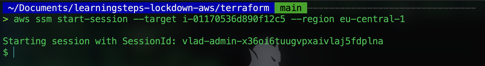 | 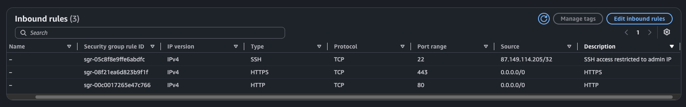 |

---

## Day 2 — TLS & WAF

**Objective:** stand up the app's public entry point with real TLS and an active WAF, using the exact same self-hosted stack as the Azure original (NPMplus + CrowdSec) — no managed service dependency, no cloud lock-in.

- NPMplus reverse proxy issues a Let's Encrypt certificate for `<elastic-ip>.nip.io`.
- CrowdSec runs as a bouncer in front of NPMplus, using the real OWASP Core Rule Set (`appsec-crs`) to detect SQLi/XSS payloads.

| Certificate issued and validated | SQLi payload blocked | NPMplus confirms TLS active |
|---|---|---|
| 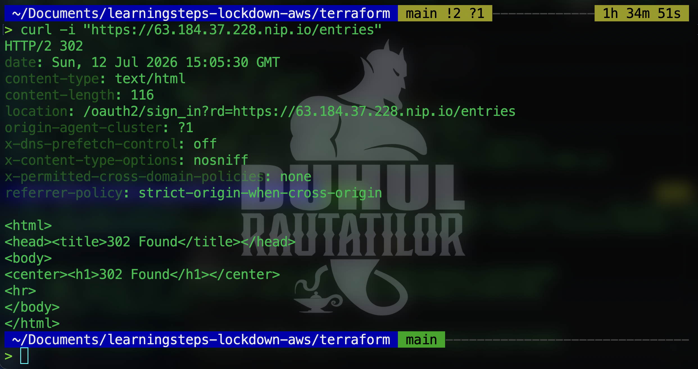 | 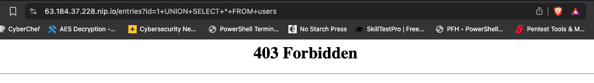 | 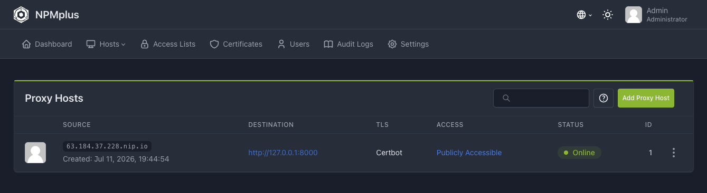 |

---

## Day 3 — Identity

**Objective:** put a real identity gate in front of the application — no more anonymous reads/writes — using a "security sidecar" pattern (`oauth2-proxy`) that requires zero application code changes.

- Amazon Cognito User Pool + App Client stand in for the Entra ID App Registration.
- `oauth2-proxy` validates sessions against Cognito's OIDC endpoint and is wired into NPMplus via its **Auth Request** feature.
- Confirmed end-to-end: anonymous requests get `302` to the Cognito hosted login page; authenticated sessions reach the app.

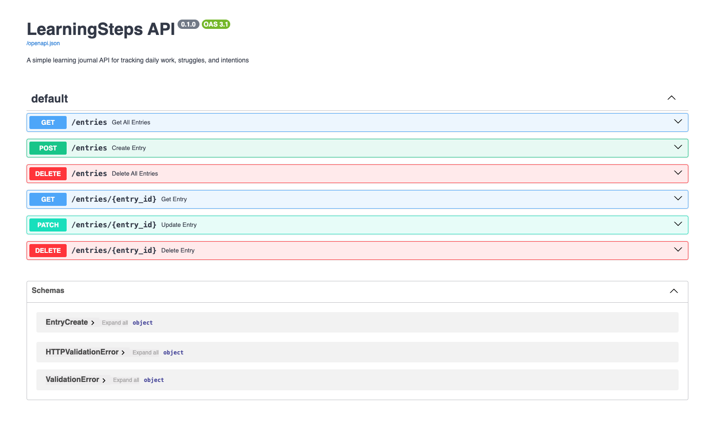

---

## Day 4 — Data Isolation

**Objective:** pull the database off the public internet, with zero data loss.

- Backed up the database (`pg_dump`) before any change, exactly as the exercise requires.
- Set `publicly_accessible = false` on the RDS instance.
- Confirmed the laptop can no longer resolve or reach the database, while the application (through the VM) keeps working with the exact same data.

| Connection times out from the laptop | Application still serves the data | RDS confirmed private and encrypted |
|---|---|---|
| 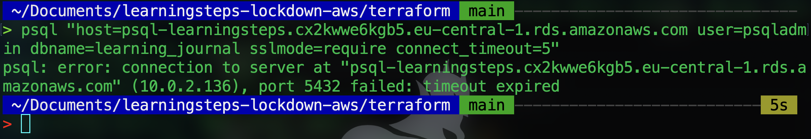 | 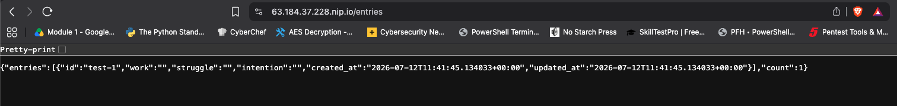 | 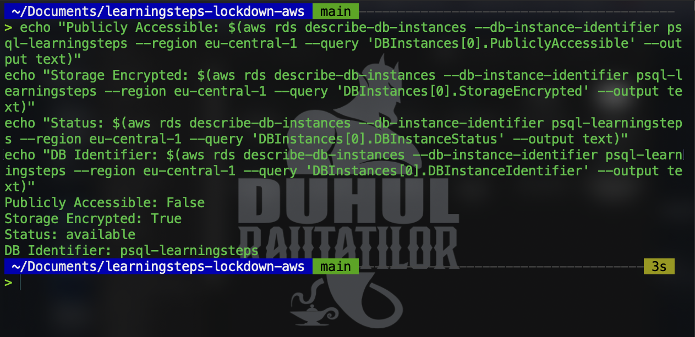 |

---

## Day 5 — Monitoring & Incident Response

**Objective:** verify the automated SOC pipeline actually catches and responds to an attack, not just that it's configured.

The pipeline: `nginx access log → JSON forwarder → CloudWatch Logs → Logs Insights query / Lambda (every 5 min) → Network ACL deny rule`.

1. Generated a real SQLi attack from an authenticated browser session (identity gate active, exactly per the exercise's warning that unauthenticated attacks never reach the WAF).
2. Validated the detection query manually in CloudWatch Logs Insights.
3. Let the scheduled Lambda run and confirmed it blocked the attacking IP automatically — and, live, also caught a **real, unprompted attacker** from a different IP during testing.
4. Confirmed the block was a genuine network-layer cutoff (`curl` timeout), not just a logged event.

| CloudWatch Logs Insights confirms the detection query | Lambda's automatic Network ACL deny rule | Geographic dashboard of blocked attackers |
|---|---|---|
| 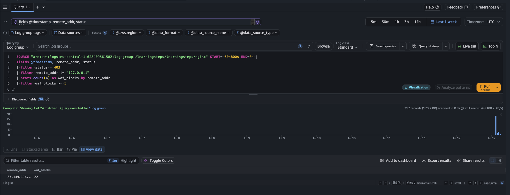 | 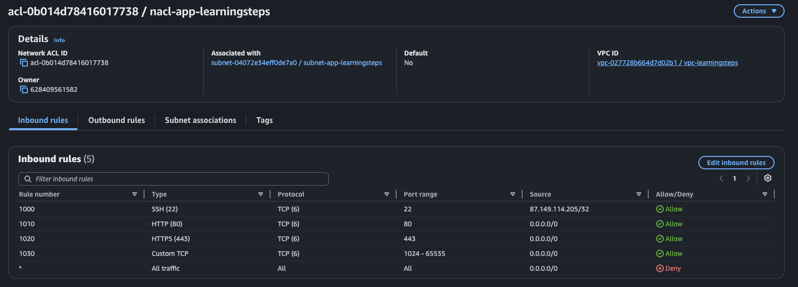 | 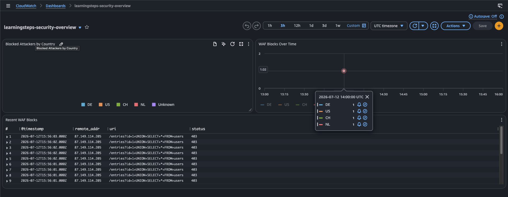 |

---

## Beyond the Requirements

The five days above cover the assignment. Everything below was added afterward, deliberately, to reflect what a Cloud Security Engineer would actually add to a real environment — all still inside the $0 Free Plan boundary.

- **AWS Secrets Manager** — the RDS password lives in Secrets Manager, not in `user_data` or on disk. The VM fetches it dynamically at boot via its IAM Role. Direct equivalent of the Azure Key Vault + Managed Identity bonus.
- **CloudTrail** — multi-region, log file validation enabled, shipped to both S3 (versioned, Block Public Access, 90-day lifecycle) and CloudWatch Logs.
- **CloudWatch Alarms + SNS** — real-time email alerts on root account usage and any IAM create/modify/delete action, fed from CloudTrail.
- **IAM Access Analyzer** — continuously reviews the account for unintended external access and unused permissions.
- **RDS encryption at rest** — `storage_encrypted = true` (forced a real destroy/recreate, backup/restore tested again as a result).
- **MFA-required IAM policy** — denies nearly all actions for the admin IAM user unless MFA is present on the session, regardless of how the credentials were obtained.
- **Fully reproducible provisioning** — every manual step performed live on the VM (Docker, NPMplus, CrowdSec, log forwarding, CloudWatch Agent) was folded back into `cloud-init.yaml`. A `terraform destroy` + `terraform apply` from zero recreates the entire environment with no manual intervention.

---

## Key Architectural Differences from Azure

Documented here because understanding *why* something is different — not just that it is — is the actual point of doing this translation twice.

- **RDS network migration is non-destructive.** Azure's VNet Integration is a `ForceNew` attribute — flipping it destroys and recreates the database, which is why the Azure exercise requires a backup/restore. AWS's `publicly_accessible` is a mutable, in-place attribute — the migration in Day 4 needed *zero* restore. Documented this explicitly as a real architectural difference, not treated it as "AWS is better," since backup discipline is still the right habit either way.
- **AWS Security Groups have no Deny rules.** Azure NSGs support Allow *and* Deny with priorities, which the original Day 5 auto-block relies on. AWS Security Groups are Allow-only — the auto-block here uses a **Network ACL** instead, which is stateless and does support ordered Deny rules, matching the Azure priority model.
- **No free FQDN for EC2.** Azure's `domain_name_label` gives a working DNS name out of the box; AWS gives none for EC2. Solved with `nip.io` rather than a paid Route53 zone.
- **Keyless access uses a different mechanism entirely.** Entra ID's `AADSSHLoginForLinuxExtension` grants OS-level login through directory identity. SSM Session Manager achieves the same *outcome* (no static credentials, fully audited) through a completely different mechanism (an agent-based tunnel, not a login extension) — worth knowing these aren't drop-in equivalents even though they solve the same problem.

---

## Repository Structure

```
terraform/
├── provider.tf              # AWS + archive providers
├── variables.tf              # Region, prefix, credentials as variables
├── main.tf                   # Shared locals (tags)
├── network.tf                 # VPC, subnet, IGW, route table, Security Group
├── ec2.tf                    # EC2 instance, AMI lookup, Elastic IP
├── iam.tf                    # VM IAM role, SSM policy attachment
├── rds.tf                    # RDS instance, DB subnet group, DB security group
├── cognito.tf                 # User Pool, App Client, Domain
├── secrets-manager.tf         # RDS password secret + VM read permission
├── monitoring.tf              # CloudWatch Log Group, Network ACL, Lambda, EventBridge
├── cloudtrail.tf               # Multi-region trail, S3 bucket + hardening, CW Logs integration
├── alerts.tf                  # SNS topic, metric filters, CloudWatch Alarms
├── geo-dashboard.tf            # CloudWatch Dashboard (geo pie chart, timeseries, log table)
├── access-analyzer.tf          # IAM Access Analyzer
├── mfa-policy.tf               # MFA-required IAM policy
├── resource-group.tf           # Tag-based Resource Group (organizational only)
├── outputs.tf                 # VM IP, instance ID, SSM connect command, DB endpoint
└── scripts/
    ├── cloud-init.yaml         # Full VM provisioning, idempotent, runs everything below
    ├── setup-npmplus.sh        # Docker + NPMplus + CrowdSec baseline
    ├── setup-json-logging.sh   # nginx access.log → syslog JSON forwarder
    ├── setup-cloudwatch-logging.sh  # rsyslog cleanup + CloudWatch Agent
    ├── geo-export/
    │   └── export-geo-metrics.sh   # CrowdSec decision countries → CloudWatch metrics
    └── waf-attack-detector/
        └── handler.py           # Lambda: queries Logs Insights, adds NACL deny rules
```

---

## Deploying This Yourself

```bash
cd terraform
terraform init
cp terraform.tfvars.example terraform.tfvars   # fill in a real DB password
terraform apply
```

Connect to the instance (no SSH key needed):

```bash
aws ssm start-session --target <instance-id> --region eu-central-1
```

Access the NPMplus admin panel (not exposed publicly, tunnel only):

```bash
aws ssm start-session --target <instance-id> --region eu-central-1 \
  --document-name AWS-StartPortForwardingSession \
  --parameters '{"portNumber":["81"],"localPortNumber":["8081"]}'
# then browse to https://localhost:8081
```

## Tearing It Down

```bash
terraform destroy
```

Everything, including the CloudTrail S3 bucket (`force_destroy = true`), is designed to tear down cleanly with no manual cleanup required.
