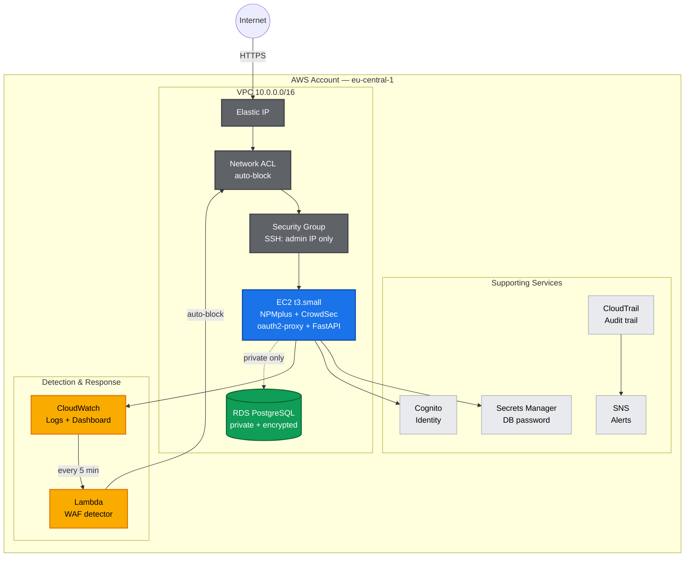

# LearningSteps Lockdown — AWS Edition


-blue)

An end-to-end Zero Trust hardening of the **LearningSteps API**, rebuilt on **AWS** as a direct architectural translation of [`learningsteps-lockdown`](https://github.com/VladvonTranssylvanien/learningsteps-lockdown), a five-day Azure security hardening project. Same application, same threat model, same five days of objectives — different cloud, different primitives.

This is not a copy-paste port. Every piece was re-derived from first principles for AWS, tested live with real attacks, real blocked traffic, and real data recovery — and every meaningful difference from the Azure original is documented below, including where AWS is genuinely better, where it's genuinely worse, and where it's just different.

---

## Table of Contents

- [Architecture](#architecture)
- [What Was Built](#what-was-built)
- [Azure → AWS: Service Mapping](#azure--aws-service-mapping)
- [What's Better on AWS](#whats-better-on-aws)
- [What's Worse or Harder on AWS](#whats-worse-or-harder-on-aws)
- [Challenges Encountered](#challenges-encountered)
- [Lessons Learned](#lessons-learned)
- [Zero-Cost Design Decisions](#zero-cost-design-decisions)
- [Day 1 — Management Access](#day-1--management-access)
- [Day 2 — TLS & WAF](#day-2--tls--waf)
- [Day 3 — Identity](#day-3--identity)
- [Day 4 — Data Isolation](#day-4--data-isolation)
- [Day 5 — Monitoring & Incident Response](#day-5--monitoring--incident-response)
- [Beyond the Requirements](#beyond-the-requirements)
- [Repository Structure](#repository-structure)
- [Deploying This Yourself](#deploying-this-yourself)
- [Tearing It Down](#tearing-it-down)

---

## Architecture



---

## What Was Built

The full account of AWS resources, all managed by Terraform:

- **Network:** custom VPC, public subnet for the app, a second subnet solely to satisfy RDS's multi-AZ subnet group requirement, Internet Gateway, route table, Security Group, Network ACL.
- **Compute:** EC2 `t3.small` (Ubuntu 22.04), fully provisioned by `cloud-init` — Docker, NPMplus, CrowdSec, the FastAPI application, log forwarding, and the CloudWatch Agent all install and configure themselves automatically at boot, with no manual steps required to reproduce the environment from zero.
- **Database:** RDS PostgreSQL 16, encrypted at rest, isolated from the public internet, restricted at the Security Group level to the app tier only.
- **Identity:** Cognito User Pool (email as username, auto-verified) + App Client, `oauth2-proxy` wired into NPMplus via Auth Request.
- **Edge:** NPMplus (reverse proxy) + CrowdSec (WAF, real OWASP CRS rules), TLS via Let's Encrypt.
- **Secrets:** AWS Secrets Manager holding the RDS password; the VM reads it dynamically via its IAM Role, never as a static credential.
- **Detection & response:** CloudWatch Logs (JSON-formatted nginx access logs), a Lambda function that queries Logs Insights every 5 minutes and adds Network ACL deny rules automatically, EventBridge as the scheduler.
- **Audit & alerting:** multi-region CloudTrail (S3 + CloudWatch Logs), CloudWatch Alarms wired to SNS for root account usage and IAM changes, IAM Access Analyzer, an MFA-required IAM policy.
- **Visibility:** a CloudWatch Dashboard combining a geographic breakdown of blocked attackers, a WAF-blocks timeseries, and a live table of recent blocks.
- **Stability & hygiene:** Elastic IP (so TLS certs, Cognito callbacks, and oauth2-proxy config survive EC2 stop/start), an AWS Resource Group for at-a-glance visibility, a hardened S3 bucket (versioning, Block Public Access, 90-day lifecycle) for CloudTrail logs.

---

## Azure → AWS: Service Mapping

| Concept | Azure (original) | AWS (this project) |
|---|---|---|
| Compute | Azure VM (Standard_D2s_v3) | EC2 (t3.small) |
| Network | Azure VNet + NSG | VPC + Security Group + Network ACL |
| Keyless management access | Entra ID (`AADSSHLoginForLinux`) | IAM Role + SSM Session Manager |
| Reverse proxy / WAF | NPMplus + CrowdSec | NPMplus + CrowdSec (identical, self-hosted on either cloud) |
| Identity provider | Microsoft Entra ID (App Registration) | Amazon Cognito (User Pool + App Client) |
| Database | Azure PostgreSQL Flexible Server | Amazon RDS for PostgreSQL |
| DB network isolation | VNet Integration (forces destroy/recreate) | `publicly_accessible = false` (in-place update) |
| Secrets | Azure Key Vault + Managed Identity | AWS Secrets Manager + IAM Role |
| SIEM / detection | Microsoft Sentinel + KQL | CloudWatch Logs Insights + Lambda |
| Automated response | Logic App playbook | Lambda + boto3 |
| Audit trail | Azure Activity Log | AWS CloudTrail (multi-region) |
| Alerting | Sentinel Automation Rule | CloudWatch Alarms + SNS |
| Public DNS for TLS | `domain_name_label` (free Azure FQDN) | `nip.io` (free wildcard DNS) |
| Stable public IP | Static Public IP | Elastic IP |

---

## What's Better on AWS

Real advantages found while building this, not just "AWS won" for its own sake:

- **RDS's network migration is non-destructive.** Flipping `publicly_accessible` to `false` is a mutable, in-place update — no destroy/recreate, no data loss, no restore needed. Azure's equivalent (VNet Integration) is a `ForceNew` attribute that destroys and recreates the entire database server. Day 4 on Azure *requires* a backup/restore because of this; on AWS it's optional discipline, not a hard requirement.
- **SSM Session Manager needs no extension install.** Azure's `AADSSHLoginForLinuxExtension` has to be explicitly installed and can silently fail if the VM has no public IP (a real, documented Azure Policy conflict from the original project). SSM works purely through the IAM Role and the SSM Agent that ships pre-installed on Amazon Linux/Ubuntu AMIs — no extension, no NIC-level public IP requirement at all.
- **CrowdSec's `whitelist-good-actors` and allowlist system is more transparent and scriptable than CrowdSec-on-Azure's equivalent config**, since `cscli` commands are identical either way but AWS's IAM model made it trivial to grant the Lambda exactly the two permissions it needs (`DescribeNetworkAcls`, `CreateNetworkAclEntry`) with no broader blast radius.
- **CloudTrail is genuinely free at the tier used here.** Azure Activity Log is also free, but CloudTrail's multi-region, multi-account design (even though this project uses one region/account) is a more mature, more commonly-referenced skill in the industry.

---

## What's Worse or Harder on AWS

Equally real friction points, documented honestly rather than glossed over:

- **No free FQDN for EC2.** Azure's `domain_name_label` gives a working DNS name (`<label>.<region>.cloudapp.azure.com`) automatically, at zero cost. AWS gives nothing equivalent for EC2 — solved here with `nip.io`, a third-party wildcard DNS service, which works but is a workaround, not a first-party feature.
- **Security Groups have no Deny rules at all.** Azure NSGs support Allow *and* Deny with priorities, which the original Day 5 auto-block relies on directly. AWS Security Groups are Allow-only — the Day 5 auto-block here had to be built on a **Network ACL** instead, a genuinely different resource type with its own numbering and statelessness quirks, adding real complexity that Azure's model didn't require.
- **RDS requires a multi-AZ subnet group even for a single-AZ instance.** A second, otherwise-unused subnet had to be created purely to satisfy this requirement — an extra resource with no functional purpose beyond satisfying an API constraint.
- **`aws login`'s new browser-based credential flow doesn't integrate with Terraform's AWS provider out of the box.** It required manually bridging `~/.aws/config` with a `credential_process` pointing at a named profile — an extra, undocumented step that Azure CLI's `az login` doesn't need (Terraform's `azurerm` provider reads Azure CLI credentials natively).
- **RDS password validation is stricter and less obvious.** `/`, `@`, `"`, and spaces are silently rejected with a generic error, discovered only by trial and error, not surfaced anywhere in the Terraform plan output.
- **GuardDuty and Security Hub are unavailable on the Free Plan.** Both are core AWS security services, but both return `SubscriptionRequiredException` without an upgrade to a Paid Plan — meaning genuinely important detection tooling was out of reach for a $0 budget in a way that had no equivalent limitation on the Azure side (Sentinel was fully usable throughout the Azure project).

---

## Challenges Encountered

- **CrowdSec blocking its own admin traffic.** The WAF's `access_by_lua_block` inspects *all* traffic through NPMplus, including the SSM-tunneled connection to NPMplus's own admin panel on port 81. Repeated admin actions were misclassified as an attack and the admin's own IP got auto-banned — solved with a dedicated CrowdSec allowlist, but only found by directly reading nginx's error logs during a live outage.
- **CloudWatch Logs Insights couldn't parse the log format at first.** rsyslog was writing a syslog-prefixed line (`Jul 12 13:11:10 host nginx: {json}`) instead of clean JSON, so `fields`/`filter` in Logs Insights silently matched nothing. Fixed with an rsyslog template (`%msg:2:$%`) that strips the prefix before it ever reaches the log file CloudWatch Agent tails.
- **The RDS country field was in an undocumented location.** CrowdSec's decision JSON exposes the attacker's country as `source.cn`, not a top-level `country` field as first assumed — found only by dumping and inspecting the raw JSON directly, not from any CrowdSec documentation.
- **A real, unprompted attacker showed up during Day 5 testing.** While validating the auto-block pipeline with a controlled test payload, the Lambda also caught and blocked a second, genuine attacker (a different IP, from a different country) probing the same endpoint — unplanned, but a strong live confirmation that the detection pipeline works against real traffic, not just staged tests.

---

## Lessons Learned

- **A resource being *mutable* instead of `ForceNew` is a real architectural signal, not a minor implementation detail.** It changes whether "hardening" work needs a backup plan or not, and it's worth checking a provider's schema for this before assuming two clouds' equivalent features behave the same way operationally.
- **Cloud-native security tooling (WAFs, bouncers, agents) needs to be told about its own management traffic explicitly**, or it will eventually treat legitimate admin access as an attack. This is a pattern, not a one-off bug — worth designing for from day one on any project with a self-hosted WAF.
- **Free-tier boundaries are a real constraint on tool choice, not just a pricing footnote.** Not having GuardDuty available meant building custom detection logic (the Lambda) that a Paid Plan account would likely never need to write by hand — which, incidentally, is why that Lambda exists here in code, reviewable and understood, rather than being an opaque managed service.
- **Translating an architecture between clouds is a different skill from building it once.** The parts that transferred cleanly (NPMplus, CrowdSec, the application itself) did so because they were already cloud-agnostic by design. The parts that required real rework (auto-block mechanism, DNS, keyless access) were exactly the parts most tightly coupled to Azure-specific primitives — a useful signal for how to design future infrastructure to be more portable from the start.

---

## Zero-Cost Design Decisions

This project runs entirely on **AWS Free Plan**, which structurally cannot incur real charges (exceeding free-tier services requires an explicit upgrade to a Paid Plan, which was never done):

- **`nip.io` instead of a paid domain** — zero cost, zero DNS setup, a real trusted Let's Encrypt certificate.
- **No NAT Gateway** — the single largest hidden cost trap in AWS (~$0.045/hr + data). Avoided by keeping the app in a public subnet with a tight Security Group.
- **RDS storage capped at 20GB** — the Azure original used 32GB; RDS Free Tier only covers 20GB, so storage was reduced accordingly (documented trade-off, not an oversight).
- **No AWS WAF (managed)** — billed per Web ACL, per rule, per request. CrowdSec (self-hosted, same tool as Azure) used instead, free and arguably more transparent about what it blocks.
- **GuardDuty and Security Hub attempted, not included** — both need a Paid Plan; left out rather than accidentally triggering a billing tier change.
- **Elastic IP** — free while attached to a running instance, which it always is here; added specifically to stop TLS certs, Cognito callback URLs, and oauth2-proxy config from breaking on every EC2 stop/start.

---

## Day 1 — Management Access

**Objective:** replace SSH keys with identity-based, keyless access, and lock the network perimeter to a single IP.

- EC2 instance profile (IAM Role) grants `AmazonSSMManagedInstanceCore`, enabling `aws ssm start-session` — no SSH key ever generated, stored, or leaked.
- Security Group and Network ACL both restrict port 22 to the administrator's IP specifically, not `0.0.0.0/0`.

**Keyless login via SSM — no password, no key file:**


**SSH restricted at the network layer to a single admin IP:**


---

## Day 2 — TLS & WAF

**Objective:** stand up the app's public entry point with real TLS and an active WAF, using the exact same self-hosted stack as the Azure original (NPMplus + CrowdSec).

- NPMplus reverse proxy issues a Let's Encrypt certificate for `<elastic-ip>.nip.io`.
- CrowdSec runs as a bouncer in front of NPMplus, using the real OWASP Core Rule Set (`appsec-crs`) to detect SQLi/XSS payloads.

**Certificate issued and validated (`HTTP/2`, real Let's Encrypt cert):**


**SQLi payload blocked by CrowdSec:**


**NPMplus confirms the certificate is active (Certbot, Online):**


---

## Day 3 — Identity

**Objective:** put a real identity gate in front of the application, using a "security sidecar" pattern (`oauth2-proxy`) that requires zero application code changes.

- Amazon Cognito User Pool + App Client stand in for the Entra ID App Registration.
- `oauth2-proxy` validates sessions against Cognito's OIDC endpoint and is wired into NPMplus via its **Auth Request** feature.
- Confirmed end-to-end: anonymous requests get `302` to the Cognito hosted login page; authenticated sessions reach the app.

**Authenticated session reaching the application (Swagger UI):**


---

## Day 4 — Data Isolation

**Objective:** pull the database off the public internet, with zero data loss.

- Backed up the database (`pg_dump`) before any change.
- Set `publicly_accessible = false` on the RDS instance.
- Confirmed the laptop can no longer resolve or reach the database, while the application (through the VM) keeps working with the exact same data.

**Connection times out from the laptop — RDS is no longer publicly reachable:**


**Application still serves the exact same data through the VM:**


**RDS confirmed private and encrypted:**


---

## Day 5 — Monitoring & Incident Response

**Objective:** verify the automated SOC pipeline actually catches and responds to an attack, not just that it's configured.

The pipeline: `nginx access log → JSON forwarder → CloudWatch Logs → Logs Insights query / Lambda (every 5 min) → Network ACL deny rule`.

1. Generated a real SQLi attack from an authenticated browser session.
2. Validated the detection query manually in CloudWatch Logs Insights.
3. Let the scheduled Lambda run and confirmed it blocked the attacking IP automatically — and, live, also caught a **real, unprompted attacker** from a different IP during testing.
4. Confirmed the block was a genuine network-layer cutoff (`curl` timeout), not just a logged event.

**CloudWatch Logs Insights confirms the detection query (22 blocks from the same IP):**


**Lambda's automatic Network ACL deny rules — both the test IP and a real, unprompted attacker caught live:**


**Geographic dashboard of blocked attackers, built from CrowdSec decision data:**


---

## Beyond the Requirements

Everything below was added after the five required days, deliberately, to reflect what a Cloud Security Engineer would actually add to a real environment — all still inside the $0 Free Plan boundary.

- **AWS Secrets Manager** — direct equivalent of the Azure Key Vault + Managed Identity bonus.
- **CloudTrail** — multi-region, log file validation, S3 (hardened) + CloudWatch Logs.
- **CloudWatch Alarms + SNS** — real-time email alerts on root usage and IAM changes.
- **IAM Access Analyzer** — continuous review for unintended external access and unused permissions.
- **RDS encryption at rest** — forced a real destroy/recreate, backup/restore tested again as a result.
- **MFA-required IAM policy** — denies nearly all actions unless MFA is present on the session.
- **Fully reproducible provisioning** — every manual step performed live on the VM was folded back into `cloud-init.yaml`. A `terraform destroy` + `terraform apply` from zero recreates the entire environment with no manual intervention.

---

## Repository Structure

```
terraform/
├── provider.tf                  # AWS + archive providers
├── variables.tf                 # Region, prefix, credentials as variables
├── main.tf                      # Shared locals (tags)
├── network.tf                   # VPC, subnet, IGW, route table, Security Group
├── ec2.tf                       # EC2 instance, AMI lookup, Elastic IP
├── iam.tf                       # VM IAM role, SSM policy attachment
├── rds.tf                       # RDS instance, DB subnet group, DB security group
├── cognito.tf                   # User Pool, App Client, Domain
├── secrets-manager.tf           # RDS password secret + VM read permission
├── monitoring.tf                # CloudWatch Log Group, Network ACL, Lambda, EventBridge
├── cloudtrail.tf                # Multi-region trail, S3 bucket + hardening, CW Logs integration
├── alerts.tf                    # SNS topic, metric filters, CloudWatch Alarms
├── geo-dashboard.tf              # CloudWatch Dashboard (geo pie chart, timeseries, log table)
├── access-analyzer.tf            # IAM Access Analyzer
├── mfa-policy.tf                 # MFA-required IAM policy
├── resource-group.tf             # Tag-based Resource Group (organizational only)
├── outputs.tf                   # VM IP, instance ID, SSM connect command, DB endpoint
└── scripts/
    ├── cloud-init.yaml           # Full VM provisioning, idempotent, runs everything below
    ├── setup-npmplus.sh          # Docker + NPMplus + CrowdSec baseline
    ├── setup-json-logging.sh     # nginx access.log → syslog JSON forwarder
    ├── setup-cloudwatch-logging.sh  # rsyslog cleanup + CloudWatch Agent
    ├── geo-export/
    │   └── export-geo-metrics.sh     # CrowdSec decision countries → CloudWatch metrics
    └── waf-attack-detector/
        └── handler.py             # Lambda: queries Logs Insights, adds NACL deny rules
```

---

## Deploying This Yourself

```bash
cd terraform
terraform init
cp terraform.tfvars.example terraform.tfvars   # fill in a real DB password
terraform apply
```

Connect to the instance (no SSH key needed):

```bash
aws ssm start-session --target <instance-id> --region eu-central-1
```

Access the NPMplus admin panel (not exposed publicly, tunnel only):

```bash
aws ssm start-session --target <instance-id> --region eu-central-1 \
  --document-name AWS-StartPortForwardingSession \
  --parameters '{"portNumber":["81"],"localPortNumber":["8081"]}'
# then browse to https://localhost:8081
```

## Tearing It Down

```bash
terraform destroy
```

Everything, including the CloudTrail S3 bucket (`force_destroy = true`), is designed to tear down cleanly with no manual cleanup required.
