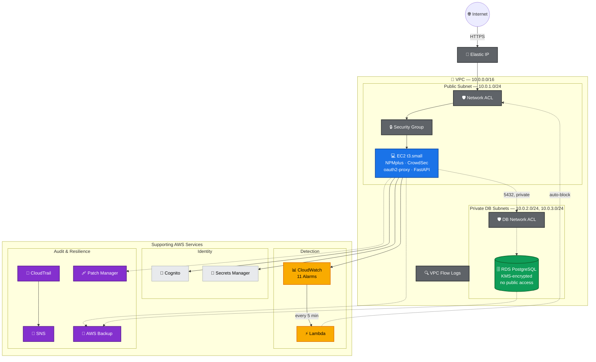
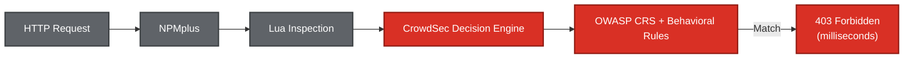
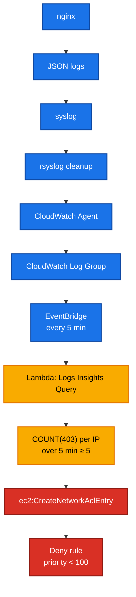
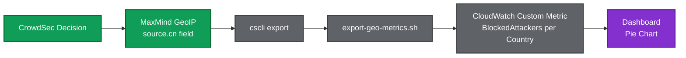

# LearningSteps Lockdown — AWS Edition

<div align="center">


-blue)


</div>

---

## 📋 Executive Summary

A **Zero Trust security hardening** of the LearningSteps API, rebuilt on **AWS** as a direct architectural translation of a five-day Azure security project.

**Key Achievements:**
- ✅ **5-day security implementation** — Management Access → TLS/WAF → Identity → Data Isolation → Monitoring
- ✅ **100% Terraform-managed** — Full infrastructure as code
- ✅ **Zero-cost design** — All resources within AWS Free Tier limits
- ✅ **Real attack validation** — System caught and blocked an unplanned, genuine attacker during testing
- ✅ **Multi-cloud expertise** — Documented Azure ↔ AWS service mapping with comparative analysis
- ✅ **CIS AWS Foundations-aligned hardening** — customer-managed KMS keys, locked backups, VPC Flow Logs, 11 CloudWatch security alarms

**Same application, same threat model — different cloud, different primitives.** This is not a copy-paste port; every piece was re-derived from first principles for AWS.

---

## 📚 Table of Contents

- [Executive Summary](#-executive-summary)
- [Architecture Overview](#-architecture-overview)
- [What Was Built](#-what-was-built)
- [Azure → AWS Service Mapping](#-azure--aws-service-mapping)
- [Comparative Analysis](#-comparative-analysis)
- [Challenges & Lessons Learned](#-challenges--lessons-learned)
- [Zero-Cost Design](#-zero-cost-design)
- [Implementation Journey](#-implementation-journey)
- [Technical Deep Dive](#-technical-deep-dive)
- [Beyond Requirements](#-beyond-requirements)
- [Repository Structure](#-repository-structure)
- [Deployment Guide](#-deployment-guide)
- [Teardown](#-teardown)
- [Skills Demonstrated](#-skills-demonstrated)

---

## 🏗️ Architecture Overview



### Security Layers (Defense in Depth)

| Layer | Technology | Purpose |
|-------|-----------|---------|
| **Edge** | CrowdSec + OWASP CRS | Real-time WAF blocking (milliseconds) |
| **Network** | Network ACL (app + db, separate) | Stateless deny rules, auto-blocking |
| **Compute** | Security Group (restricted egress) | Stateful allow rules, SSH restriction |
| **Identity** | Cognito + oauth2-proxy | Authentication & authorization |
| **Data** | RDS (private, KMS-encrypted) + Secrets Manager | Encrypted at rest, credential isolation |
| **Backup** | AWS Backup + Vault Lock | Immutable, ransomware-resistant recovery points |
| **Monitoring** | CloudWatch + CloudTrail + VPC Flow Logs | Detection, alerting, packet-level audit |
| **Patching** | SSM Patch Manager | Automated weekly OS security patches |

---

## 🚀 What Was Built

| Component | Details |
|-----------|---------|
| **Network** | Custom VPC, public subnet, dedicated DB subnets, Internet Gateway, route table, Security Group (restricted egress), Network ACL (app + db, separate), locked-down default SG (CIS 5.3) |
| **Compute** | EC2 `t3.small` (Ubuntu 22.04) with `cloud-init` — fully automated provisioning, `disable_api_termination`, IMDSv2 enforced, detailed monitoring |
| **Database** | RDS PostgreSQL 16, encrypted at rest with a customer-managed KMS key, private (no public access), `rds.force_ssl` enforced, deletion protection, automated backups |
| **Identity** | Cognito User Pool (email username, 14-char password policy, optional TOTP MFA) + App Client, oauth2-proxy integration |
| **Edge** | NPMplus (reverse proxy) + CrowdSec (OWASP CRS WAF), Let's Encrypt TLS |
| **Secrets** | AWS Secrets Manager — RDS password + CrowdSec bouncer key, both read via IAM Role (no static credentials) |
| **Detection** | CloudWatch Logs + Lambda (every 5 min) → Network ACL auto-block |
| **Backup** | AWS Backup plan with **Vault Lock in Governance mode** — daily backups, 7-day retention, tamper-resistant |
| **Network Visibility** | VPC Flow Logs → CloudWatch Logs (full packet-level ACCEPT/REJECT record) |
| **Patch Management** | SSM Patch Baseline + weekly Maintenance Window — automated OS security patches |
| **Audit** | Multi-region CloudTrail (KMS-encrypted, `prevent_destroy`) → S3 + CloudWatch, dual IAM Access Analyzer (external access + unused permissions) |
| **Alerting** | 11 CloudWatch Alarms → SNS: root usage, IAM changes, access key changes, security group changes, network/NACL changes, KMS key changes, CloudTrail tampering, console login failures, console login without MFA, unauthorized API calls, EC2 status check failure |
| **Account-Level IAM** | 14-char password policy with 90-day rotation, MFA-required policy on an IAM group (not just one user) |
| **Visibility** | CloudWatch Dashboard — geo-attack map, WAF timeseries, block table |
| **Stability** | Elastic IP (survives EC2 stop/start), Resource Group, hardened S3 bucket (versioned, KMS-encrypted, `DenyInsecureTransport`) |

---

## 🔄 Azure → AWS Service Mapping

| Concept | Azure (Original) | AWS (This Project) | Key Difference |
|---------|------------------|-------------------|----------------|
| **Compute** | Azure VM (Standard_D2s_v3) | EC2 (t3.small) | Naming, sizing |
| **Network** | Azure VNet + NSG | VPC + Security Group + Network ACL | NSG = SG + NACL combined |
| **Management Access** | Entra ID (AADSSHLoginForLinux) | IAM Role + SSM Session Manager | No extension needed on AWS |
| **Reverse Proxy/WAF** | NPMplus + CrowdSec | NPMplus + CrowdSec | **Identical** (cloud-agnostic) |
| **Identity Provider** | Microsoft Entra ID | Amazon Cognito | Different service, same concept |
| **Database** | Azure PostgreSQL Flexible | RDS for PostgreSQL | Similar, different naming |
| **DB Network Isolation** | VNet Integration (ForceNew) | `publicly_accessible = false` (in-place) | **AWS is mutable** |
| **Secrets** | Key Vault + Managed Identity | Secrets Manager + IAM Role | Similar pattern |
| **SIEM/Detection** | Microsoft Sentinel + KQL | CloudWatch Logs Insights + Lambda | AWS = build-your-own |
| **Automated Response** | Logic App | Lambda + boto3 | AWS = code, Azure = low-code |
| **Audit Trail** | Azure Activity Log | CloudTrail (multi-region, KMS-encrypted) | AWS more comprehensive |
| **Alerting** | Sentinel Automation | CloudWatch Alarms + SNS | Different approach |
| **Backup** | Azure Backup | AWS Backup + Vault Lock | AWS adds immutability option |
| **Network Visibility** | NSG Flow Logs | VPC Flow Logs | Equivalent |
| **Patch Management** | Azure Update Manager | SSM Patch Manager | Equivalent |
| **DNS (Free)** | `domain_name_label` (Azure FQDN) | `nip.io` (third-party) | **AWS lacks free FQDN** |
| **Stable IP** | Static Public IP | Elastic IP | Equivalent |

---

## 📊 Comparative Analysis

### ✅ What's Better on AWS

**1. RDS Network Migration is Non-Destructive**

| Aspect | Azure | AWS |
|--------|-------|-----|
| **Operation** | VNet Integration | `publicly_accessible = false` |
| **Effect** | **ForceNew** — destroys/recreates DB | **In-place update** — no downtime |
| **Impact** | Requires backup/restore for Day 4 | Optional discipline, not mandatory |

**2. SSM Session Manager — No Extension Required**

| Aspect | Azure (AADSSHLogin) | AWS (SSM) |
|--------|---------------------|-----------|
| **Installation** | Explicit extension install | **Pre-installed** on AMI |
| **Dependencies** | Requires VM public IP | Works via IAM Role |
| **Failure Mode** | Can silently fail | Reliable by design |

**3. IAM Least-Privilege is Cleaner**
- Lambda only needed 2 permissions: `DescribeNetworkAcls` and `CreateNetworkAclEntry`
- No over-permissioning, easy to reason about

**4. CloudTrail is Genuinely Free**
- No cost at the tier used
- Multi-region by default
- Industry-standard skill

**5. AWS Backup Vault Lock Gives True Immutability**
- Governance mode with a grace period, escalating to Compliance mode
- Backups become tamper-resistant even against the account root user

### ❌ What's Worse or Harder on AWS

**1. No Free FQDN for EC2**

| Aspect | Azure | AWS |
|--------|-------|-----|
| **Free DNS** | `domain_name_label` | **None** |
| **Solution** | Built-in | `nip.io` (third-party) |

**2. Security Groups Have NO Deny Rules**

| Aspect | Azure NSG | AWS Security Group |
|--------|-----------|-------------------|
| **Allow Rules** | ✅ Yes | ✅ Yes |
| **Deny Rules** | ✅ Yes (with priorities) | ❌ **No** |

**3. RDS Multi-AZ Subnet Requirement**
- Even for a **single-AZ instance**
- Required creating a dedicated primary DB subnet alongside the secondary

**4. Free Tier Limitations**

| Service | Free Tier Availability |
|---------|----------------------|
| **GuardDuty** | ❌ Requires Paid Plan |
| **Security Hub** | ❌ Requires Paid Plan |
| **AWS WAF** | ❌ Costs per request |

**5. Customer-Managed KMS Keys Are Not Free**
- $1/month flat fee per key, regardless of usage — the only genuinely non-$0 line item in this project (two keys ≈ $2/month, a few cents for the project's duration)

---

## 🧠 Challenges & Lessons Learned

### 🔥 Challenges Encountered

**Challenge 1: CrowdSec Blocking Its Own Admin**
- **Problem:** WAF inspected SSM-tunneled admin panel access on port 81; admin actions misclassified as attacks
- **Solution:** Dedicated CrowdSec allowlist
- **Lesson:** Cloud-native security tooling needs explicit allowlisting for its own management traffic

**Challenge 2: CloudWatch Logs Insights Parsing Failure**
- **Problem:** rsyslog writing syslog-prefixed lines instead of clean JSON
- **Solution:** rsyslog template `%msg:2:$%` strips the prefix
- **Lesson:** Log formatting matters — test your parsers early

**Challenge 3: Attacker Geolocation Field Undocumented**
- **Problem:** CrowdSec exposes country as `source.cn`, not a top-level `country` field
- **Solution:** Dumped and inspected raw JSON directly
- **Lesson:** Always verify data structures yourself

**Challenge 4: An Encrypted-Volume Change Forced a Full VM Rebuild**
- **Problem:** Adding `encrypted = true` to an already-running instance's root volume forces AWS to destroy and recreate the EC2 instance — this silently wiped Docker, NPMplus, CrowdSec, and oauth2-proxy, which are not part of `cloud-init`'s one-time boot script once a volume is recreated outside of first boot
- **Solution:** Manually re-ran `setup-npmplus.sh` and `setup-oauth2-proxy.sh`, regenerated the CrowdSec bouncer key, recreated the NPMplus Proxy Host and TLS certificate
- **Lesson:** Any Terraform change with `# forces replacement` on compute needs to be treated as a full redeploy, not a config tweak — verify application-layer services after, not just the Terraform apply exit code

**Challenge 5: An AI-Assisted Restructuring Nearly Broke Public Access**
- **Problem:** A separate editing session restructured the flat `.tf` files into Terraform modules (changing every resource address) and, separately, accidentally replaced the public HTTP/HTTPS Security Group rule with a VPC-internal-only rule — both would have been catastrophic if applied blindly
- **Solution:** Caught both by reading the full `terraform plan` output line-by-line before applying, reverted the module restructuring via `git checkout`, and manually restored the public ingress rules
- **Lesson:** Never trust a plan summary count alone (`X to change`) — the line-item diff is where destructive changes hide, especially after any AI-assisted or unattended edit to security-relevant resources

**🏆 Challenge 6: Real Attacker During Testing**
- **Scenario:** While validating the auto-block pipeline, Lambda caught and blocked a genuine attacker
- **Significance:** Unplanned but strong live confirmation the pipeline works

### 📝 Lessons Learned

1. **Mutability vs. ForceNew is a real architectural signal** — changes whether hardening requires backup plans
2. **Cloud-native tooling needs management traffic whitelisted explicitly** — design for this from day one
3. **Free-tier boundaries are real constraints** — not having GuardDuty meant building custom detection logic
4. **Translating between clouds is a different skill** — cloud-agnostic parts transfer cleanly; cloud-specific parts require real rework
5. **`terraform plan`'s summary line is not a safety check** — reading the actual resource diff is the only reliable way to catch an accidental security regression before it's live

---

## 💰 Zero-Cost Design

| Decision | Cost Impact | Why It Matters |
|----------|-------------|----------------|
| `nip.io` instead of paid domain | **$0** (vs ~$12/year) | No DNS setup, trusted Let's Encrypt |
| **No NAT Gateway** | **$0** (vs ~$35/month) | Biggest hidden cost trap |
| RDS capped at 20GB | **Free** (Free Tier limit) | Azure original used 32GB |
| **CrowdSec** instead of AWS WAF | **$0** (vs per-request cost) | Self-hosted, same protection |
| **Elastic IP** (attached) | **$0** (free while attached) | Prevents TLS/callback breaks |
| **VPC Flow Logs, SSM Patch Manager, AWS Backup (7-day)** | **$0** (within Free Tier / no-cost service) | Real enterprise controls, no bill impact |
| **Customer-managed KMS keys (×2)** | **~$1/mo each** | The one deliberate exception — needed for genuine key-rotation control |

---

## 👣 Implementation Journey

### Day 1 — Management Access
**Goal:** Secure administrative access without SSH keys.

| What Was Built | Why It Matters |
|----------------|----------------|
| SSM Session Manager | No SSH keys, no bastion host |
| IAM Role-based access | Centralized permission management |
| Security Group restriction | Network-layer control |

<details>
<summary>📸 Screenshots</summary>


*SSM session established without SSH keys*


*SSH restricted to admin IP only*

</details>

### Day 2 — TLS & WAF
**Goal:** Encrypted traffic and web application firewall.

| What Was Built | Why It Matters |
|----------------|----------------|
| Let's Encrypt TLS on NPMplus | Encrypted HTTPS traffic |
| CrowdSec + OWASP CRS | Real-time attack blocking |
| OWASP Top 10 protection | Industry-standard rules |

<details>
<summary>📸 Screenshots</summary>


*TLS certificate configured in NPMplus*


*HTTPS connection verified*


*WAF blocking malicious request*

</details>

### Day 3 — Identity
**Goal:** User authentication and authorization.

| What Was Built | Why It Matters |
|----------------|----------------|
| Cognito User Pool | Managed identity provider |
| oauth2-proxy integration | OIDC authentication for app |
| Email-based sign-up | Simple user management |

<details>
<summary>📸 Screenshots</summary>


*OAuth2-authenticated session reaching the app*

</details>

### Day 4 — Data Isolation
**Goal:** Database secured from public internet.

| What Was Built | Why It Matters |
|----------------|----------------|
| RDS `publicly_accessible = false` | No public DB access |
| Security Group restriction | Only app tier can connect |
| Encryption at rest | Data protection |

<details>
<summary>📸 Screenshots</summary>


*RDS set to private — no public access*


*Application still accessing database*


*Direct DB connection from laptop blocked*

</details>

### Day 5 — Detection & Response
**Goal:** Automated threat detection and response.

| What Was Built | Why It Matters |
|----------------|----------------|
| CloudWatch Logs Insights | Log analysis queries |
| Lambda auto-blocker | Automated response |
| CloudWatch Dashboard | Visibility dashboard |

<details>
<summary>📸 Screenshots</summary>


*Query identifying attackers*


*Network ACL deny rule added automatically*


*Dashboard showing blocked attackers and geolocation*

</details>

---

## 🔬 Technical Deep Dive

### How Attacker Detection Works

The detection pipeline runs on **two parallel tracks** feeding the same Network ACL:

**1. WAF-Level Blocking (CrowdSec — Real-Time)**


**2. Log-Based Detection (Lambda — Every 5 Minutes)**


### Geolocation Pipeline



**Key Insight:** AWS never performs IP-to-country lookup; CrowdSec does it internally.

---

## 🌟 Beyond Requirements

*Added after the five required days to reflect real-world Cloud Security Engineering — all still within (or nearly within) $0 Free Tier.*

| Feature | Why It Matters |
|---------|----------------|
| **AWS Secrets Manager** (DB password + CrowdSec key) | Azure Key Vault equivalent — no static credentials anywhere |
| **CloudTrail (multi-region, KMS-encrypted, `prevent_destroy`)** | Complete, tamper-resistant audit trail |
| **CloudWatch Alarms + SNS (11 total)** | Real-time email alerts across CIS AWS Foundations controls |
| **Dual IAM Access Analyzer** | External-access findings + unused-permission findings (90-day) |
| **RDS Encryption at Rest (customer-managed KMS)** | Data protection with full key-rotation control (forced backup/restore test) |
| **MFA-Required IAM Policy (on a group, not one user)** | Any future admin inherits the requirement automatically |
| **AWS Backup + Vault Lock (Governance mode)** | Immutable, ransomware-resistant recovery points |
| **VPC Flow Logs** | Full packet-level ACCEPT/REJECT visibility, beyond HTTP-layer logs |
| **SSM Patch Manager** | Automated, scheduled OS security patching |
| **Account-level IAM password policy** | 14-char minimum, 90-day rotation, reuse prevention |
| **Locked-down default Security Group (CIS 5.3)** | Closes the "something gets attached by mistake" risk |
| **Fully Reproducible Provisioning** | `terraform destroy` + `apply` = complete rebuild |

---

## 📁 Repository Structure

```
terraform/
├── 📄 provider.tf                  # AWS + archive providers
├── 📄 variables.tf                 # Region, prefix, credentials
├── 📄 main.tf                      # Shared locals (tags)
├── 📄 network.tf                   # VPC, subnets, IGW, route table, SG, default SG lockdown
├── 📄 ec2.tf                       # EC2 instance, AMI, Elastic IP, auto-recovery alarm
├── 📄 iam.tf                       # VM IAM role, SSM policy, account password policy
├── 📄 rds.tf                       # RDS instance, dedicated subnets, parameter group (force_ssl)
├── 📄 cognito.tf                   # User Pool, App Client, Domain
├── 📄 secrets-manager.tf           # RDS password + CrowdSec bouncer key secrets
├── 📄 kms.tf                       # Customer-managed KMS key for RDS
├── 📄 monitoring.tf                # CloudWatch, Lambda, EventBridge, dedicated DB NACL
├── 📄 cloudtrail.tf                # Multi-region trail, KMS-encrypted S3 bucket
├── 📄 alerts.tf                    # SNS topic, 11 metric filters + alarms (CIS-aligned)
├── 📄 geo-dashboard.tf             # CloudWatch Dashboard
├── 📄 access-analyzer.tf           # Dual IAM Access Analyzer
├── 📄 mfa-policy.tf                # MFA-required IAM policy (group-attached)
├── 📄 backup.tf                    # AWS Backup plan, vault, Vault Lock configuration
├── 📄 flow-logs.tf                 # VPC Flow Logs
├── 📄 patch-manager.tf             # SSM Patch Baseline + Maintenance Window
├── 📄 resource-group.tf            # Tag-based Resource Group
├── 📄 outputs.tf                   # VM IP, SSM command, DB endpoint
└── 📂 scripts/
    ├── 📄 cloud-init.yaml          # Full VM provisioning (idempotent)
    ├── 📄 setup-npmplus.sh         # Docker + NPMplus + CrowdSec
    ├── 📄 setup-oauth2-proxy.sh    # oauth2-proxy installation
    ├── 📄 setup-json-logging.sh    # nginx access.log → syslog JSON
    ├── 📄 setup-cloudwatch-logging.sh  # rsyslog + CloudWatch Agent
    ├── 📂 geo-export/
    │   └── 📄 export-geo-metrics.sh     # CrowdSec → CloudWatch metrics
    └── 📂 waf-attack-detector/
        └── 📄 handler.py             # Lambda: query + NACL deny
```

---

## 🚀 Deployment Guide

### Prerequisites

- **AWS Account** (Free Tier recommended)
- **AWS CLI** configured with credentials
- **Terraform** (v1.0+)
- **IAM User** with sufficient permissions

### Quick Start

```bash
# 1. Clone repository
git clone https://github.com/VladvonTranssylvanien/learningsteps-lockdown-on-AWS
cd learningsteps-lockdown-on-AWS/terraform

# 2. Initialize Terraform
terraform init

# 3. Configure variables
cp terraform.tfvars.example terraform.tfvars
# Edit terraform.tfvars with your DB password and region

# 4. Deploy
terraform apply
# Review plan, type 'yes' to confirm
```

### Connect to Instance (No SSH Key Required)

```bash
# SSM session (no SSH key needed)
aws ssm start-session --target <instance-id> --region eu-central-1

# NPMplus admin panel (tunnel only — not exposed publicly)
aws ssm start-session --target <instance-id> --region eu-central-1 \
  --document-name AWS-StartPortForwardingSession \
  --parameters '{"portNumber":["81"],"localPortNumber":["8081"]}'
# Browse to https://localhost:8081
```

### Access the Application

1. Get the Elastic IP: `terraform output vm_public_ip`
2. Open browser: `https://<elastic-ip>.nip.io`
3. Sign up/login via Cognito
4. Access the FastAPI application

---

## 🗑️ Teardown

```bash
# CloudTrail's S3 bucket has prevent_destroy = true — remove that
# lifecycle block (or `terraform state rm` it) before destroying,
# otherwise destroy will fail partway through with everything else
# already deleted.

# Destroy everything
terraform destroy
```

---

## 🎯 Skills Demonstrated

### Cloud & Infrastructure

| Skill | Evidence |
|-------|----------|
| **AWS Services** | VPC, EC2, RDS, Cognito, IAM, KMS, CloudWatch, Lambda, Secrets Manager, CloudTrail, SNS, S3, AWS Backup, SSM |
| **Infrastructure as Code** | Complete Terraform implementation (19+ files) |
| **Multi-Cloud Translation** | Azure → AWS service mapping with comparative analysis |
| **Cost Optimization** | Near-zero-cost design; the two paid line items (KMS keys) documented and justified |

### Security Engineering

| Skill | Evidence |
|-------|----------|
| **Zero Trust Architecture** | Defense in depth: WAF, dual Network ACL, restricted-egress SG, IAM, encryption |
| **WAF Implementation** | CrowdSec + OWASP CRS (real-time blocking) |
| **Identity & Access** | Cognito + oauth2-proxy + MFA-required group policy + account password policy |
| **Secrets Management** | AWS Secrets Manager with IAM Role (no static credentials, including the WAF bouncer key) |
| **Threat Detection** | Automated Lambda-based attack detection |
| **Incident Response** | Auto-blocking via Network ACL rules |
| **Monitoring & Alerting** | CloudWatch Dashboard + 11 CIS-aligned SNS alerts |
| **Audit** | Multi-region, KMS-encrypted CloudTrail + dual IAM Access Analyzer |
| **Backup & Recovery** | AWS Backup with Vault Lock (immutable recovery points) |
| **Network Forensics** | VPC Flow Logs at the packet level |
| **Patch Management** | SSM Patch Manager, scheduled OS patching |

### Automation & DevOps

| Skill | Evidence |
|-------|----------|
| **Provisioning** | `cloud-init` with idempotent scripts |
| **Log Management** | JSON-formatted nginx logs → CloudWatch |
| **Automated Response** | EventBridge + Lambda (every 5 min) |
| **Reproducibility** | `terraform destroy` + `apply` = complete rebuild |
| **Incident Recovery** | Diagnosed and manually recovered from a full EC2 rebuild (Docker, NPMplus, CrowdSec, oauth2-proxy) after an encryption-triggered instance replacement |
| **Change Review Discipline** | Caught an accidental public-access-breaking Security Group change and an unintended module restructuring by reading full `terraform plan` diffs before applying |

### Documentation & Communication

| Skill | Evidence |
|-------|----------|
| **Technical Writing** | Comprehensive README with architecture diagrams |
| **Problem Documentation** | Challenges Encountered + Lessons Learned, including real incident recovery |
| **Comparative Analysis** | Azure vs AWS "Better/Worse" sections |
| **Evidence** | Screenshots for each day |

---

## 🙏 Acknowledgments

- **Original Project:** [`learningsteps-lockdown`](https://github.com/VladvonTranssylvanien/learningsteps-lockdown) — the Azure implementation that inspired this work
- **Tools Used:** Terraform, AWS CLI, Docker, NPMplus, CrowdSec, oauth2-proxy, Python
- **Learning Resources:** AWS Documentation, Terraform Registry, CrowdSec Documentation, CIS AWS Foundations Benchmark

---

## 📝 License

This project is for educational purposes. Please review and adapt for your own learning.

---

<div align="center">

**Built with ❤️ for learning, security, and multi-cloud mastery.**

[⬆ Back to Top](#learningsteps-lockdown--aws-edition)

</div>
