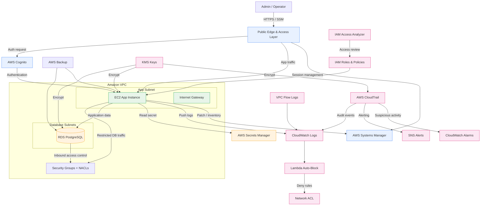

# LearningSteps Lockdown — AWS Edition

This repository contains an end-to-end AWS hardening project built with Terraform. The goal was to recreate the LearningSteps environment in AWS while translating the Azure-based security concepts from the previous module into a new cloud ecosystem.

This is not a simple copy-paste from Azure. The architecture was re-derived for AWS using AWS-native primitives, and the implementation emphasizes identity, networking, logging, encryption, monitoring, backup, and cost-awareness.

## Project purpose

This project demonstrates:

- hands-on experience with AWS
- translation of Azure concepts into AWS services
- secure infrastructure design in a multi-cloud context
- practical cloud security thinking
- awareness of Free Tier and cost-control constraints

## What was built

The deployment includes:

- a custom VPC with subnet segmentation
- an EC2 instance for the application tier
- an RDS PostgreSQL database
- IAM roles, password policy, and least-privilege access
- AWS Secrets Manager for sensitive values
- Amazon Cognito for authentication and MFA enforcement
- AWS CloudTrail for audit logging
- CloudWatch logs, alarms, and metrics
- AWS Backup and patch management
- VPC flow logs and IAM Access Analyzer
- KMS-based encryption for critical services

## Architecture overview



## Azure → AWS service mapping

| Concept | Azure original | AWS implementation |
|---|---|---|
| Compute | Azure VM | Amazon EC2 |
| Networking | Virtual Network + NSG | VPC + Security Groups + NACLs |
| Identity | Entra ID / RBAC | IAM + Cognito |
| Secrets | Key Vault | Secrets Manager |
| Monitoring | Azure Monitor / Log Analytics | CloudWatch + CloudTrail |
| Serverless | Azure Functions | AWS Lambda |
| Database | Azure Database for PostgreSQL | Amazon RDS for PostgreSQL |
| Backup | Azure Backup | AWS Backup |

## What is better on AWS in this project

Some things worked better on AWS in this implementation:

- RDS network hardening is more flexible than Azure's equivalent because the database can be made private in place.
- SSM Session Manager provides keyless administrative access without needing a separate extension workflow.
- CloudTrail is a strong audit primitive and is easy to reason about for multi-account or multi-region scenarios.
- IAM policies can be very tightly scoped, which makes least-privilege design straightforward.

## What is harder or less ergonomic on AWS

A few areas were more difficult than in Azure:

- AWS does not offer a free EC2 DNS name equivalent to Azure's simple public FQDN pattern.
- Security Groups are allow-only, which required the use of Network ACLs for the deny-based auto-block logic.
- RDS subnet requirements are stricter and require additional planning.
- AWS authentication and local CLI setup can be more manual than expected for a first-time learner.

## Key technical decisions

The following decisions were made to make the environment more secure and more realistic than a basic starter deployment:

1. Encryption by default
   - RDS uses encryption with a customer-managed KMS key.
   - EC2 root storage is encrypted.
   - CloudTrail logs are encrypted with a dedicated KMS key.

2. Identity and access hardening
   - IAM roles are used where possible.
   - account password policy is strict.
   - Cognito MFA is enforced.
   - IAM role session duration is limited to a practical value.

3. Network-layer hardening
   - Security Groups restrict traffic to only what is needed.
   - NACLs add an additional layer of control.
   - VPC flow logs improve visibility.

4. Monitoring and detection
   - CloudTrail is enabled and multi-region.
   - CloudWatch metric filters and alarms are configured for suspicious activity.
   - access key change monitoring is included.

5. Backup and resiliency
   - AWS Backup is configured for EC2 and RDS.
   - backup vault lock improves protection against accidental deletion.
   - SSM patching and maintenance windows are configured.

6. Secrets and configuration
   - database credentials are stored in Secrets Manager.
   - sensitive values are not embedded directly in plain-text provisioning files.

## Security improvements added in this project

Compared to a very basic AWS deployment, the following hardening measures were added:

- enforced MFA in Cognito
- stricter IAM session duration
- CloudTrail-based alerts for suspicious IAM activity
- encrypted storage for EC2 and RDS
- dedicated KMS keys for sensitive services
- flow logs for network visibility
- backup plan with vault lock
- SSM patching and maintenance window
- EC2 monitoring enabled

## Challenges encountered

Some of the real challenges during the implementation were:

- CrowdSec initially blocked its own admin traffic and required a targeted allowlist.
- CloudWatch Logs Insights did not parse the early log format correctly until the log pipeline was cleaned up.
- the geolocation field in CrowdSec data was not where it was first expected.
- a real attacker appeared during testing, which confirmed that the detection pipeline was working live.

## Lessons learned

The biggest lessons from this project were:

- AWS and Azure share the same core cloud concepts, but the implementation details are different.
- network security in AWS relies heavily on explicit configuration.
- IAM, logging, encryption, and backup are essential building blocks of secure infrastructure.
- multi-cloud work requires both technical skill and architectural thinking.
- cost awareness is a real and important part of cloud engineering.

## Zero-cost design decisions

This project was designed to stay within the AWS Free Tier spirit as much as possible:

- nip.io is used instead of a paid domain for the public TLS endpoint
- no NAT Gateway is used to avoid an unnecessary cost trap
- RDS storage is kept modest and practical
- managed WAF was avoided in favor of a free self-hosted CrowdSec-based approach
- GuardDuty and Security Hub were not used because they require a paid plan
- Elastic IP is used to keep TLS and application configuration stable across restarts

## Repository structure

```text
terraform/
├── provider.tf
├── variables.tf
├── main.tf
├── network.tf
├── ec2.tf
├── iam.tf
├── rds.tf
├── cognito.tf
├── secrets-manager.tf
├── monitoring.tf
├── cloudtrail.tf
├── alerts.tf
├── geo-dashboard.tf
├── access-analyzer.tf
├── mfa-policy.tf
├── resource-group.tf
├── outputs.tf
└── scripts/
    ├── cloud-init.yaml
    ├── setup-npmplus.sh
    ├── setup-json-logging.sh
    ├── setup-cloudwatch-logging.sh
    ├── geo-export/
    └── waf-attack-detector/
```

## Deployment

```bash
cd terraform
terraform init
cp terraform.tfvars.example terraform.tfvars
terraform plan
terraform apply
```

You may need to provide a real database password and other required values in `terraform.tfvars`.

## Connecting to the environment

Connect to the EC2 instance without a SSH key using SSM:

```bash
aws ssm start-session --target <instance-id> --region eu-central-1
```

## Tearing it down

```bash
cd terraform
terraform destroy
```

## Final assessment

This project is a strong fit for the module requirements. It demonstrates hands-on AWS experience, careful security thinking, and a real understanding of how core cloud concepts differ between Azure and AWS. It goes beyond a basic starter deployment by applying multi-layered security controls, observability, backups, and cost-awareness in a realistic way.
