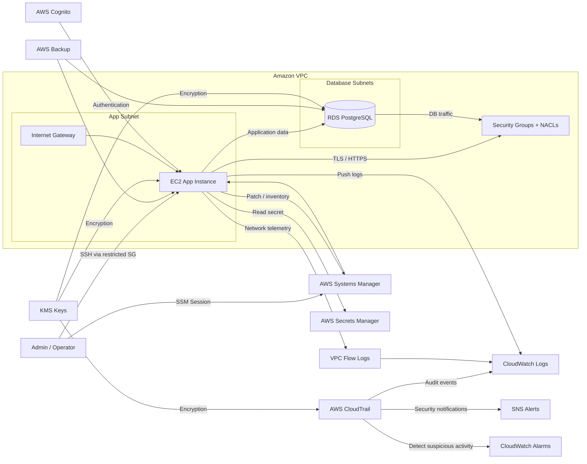

# LearningSteps Lockdown on AWS

This project recreates the LearningSteps infrastructure in Amazon Web Services (AWS) using Terraform. The goal was not only to build a working AWS environment, but also to translate the Azure knowledge gained in the previous module into a new cloud ecosystem and to apply security principles in a cost-conscious way.

## Project purpose

This repository demonstrates:

- hands-on experience with AWS
- the translation of Azure concepts into AWS services
- secure infrastructure design in a multi-cloud context
- practical cloud security thinking
- awareness of Free Tier and cost-control principles

## What this project implements

The deployment includes:

- a VPC with public and private-style segmentation
- an EC2 instance for the application tier
- an RDS PostgreSQL database
- IAM roles and account password policy
- Secrets Manager for sensitive values
- Cognito for authentication and MFA enforcement
- CloudTrail for audit logging
- CloudWatch alarms and log-based metrics
- AWS Backup and patch management
- flow logs and access analyzer
- KMS-based encryption for critical services

## Architecture overview



## Azure to AWS mapping

| Concept | Azure | AWS |
|---|---|---|
| Virtual Machines | Azure Virtual Machines | Amazon EC2 |
| Networking | Virtual Network | Amazon VPC |
| Security Groups | NSG | Security Groups + NACLs |
| Identity | Entra ID / RBAC | IAM + Cognito |
| Secrets | Key Vault | Secrets Manager |
| Monitoring | Azure Monitor / Log Analytics | CloudWatch + CloudTrail |
| Serverless | Azure Functions | Lambda |
| Database | Azure SQL / PostgreSQL | Amazon RDS |
| Backup | Azure Backup | AWS Backup |

## Key technical decisions

The following choices were made to make the deployment more secure and more realistic than a basic starter setup:

1. Encryption by default
   - RDS uses encryption with a customer-managed KMS key.
   - EC2 root storage is encrypted.
   - CloudTrail logs are encrypted with a dedicated KMS key.

2. Identity and access hardening
   - IAM roles are used where possible.
   - account password policy is strict.
   - Cognito MFA is enforced.
   - IAM role session duration is limited to a practical value.

3. Network security
   - security groups are used to limit traffic.
   - NACLs are configured for additional network-layer control.
   - flow logs are enabled for visibility.

4. Monitoring and detection
   - CloudTrail is enabled and multi-region.
   - CloudWatch metric filters and alarms are configured for suspicious activity.
   - access key change monitoring is included.

5. Backup and resiliency
   - AWS Backup is configured for the EC2 instance and RDS database.
   - backup vault lock is used to improve protection against accidental deletion.
   - patch baseline and maintenance window are configured through SSM.

6. Secrets and configuration
   - database credentials are stored in Secrets Manager.
   - sensitive values are not kept directly in plain-text provisioning files.

## Security improvements added in this project

Compared to a very basic AWS deployment, the following hardening measures were added:

- enforced MFA in Cognito
- stricter IAM session duration
- CloudTrail-based alerts for suspicious IAM activity
- encrypted storage for EC2 and RDS
- separate KMS keys for sensitive services
- flow logs for network visibility
- backup plan with vault lock
- SSM patching and maintenance window
- monitoring enabled for the EC2 instance

## Cost and Free Tier awareness

This project was designed with cost awareness in mind:

- small and practical instance sizes were used
- the architecture avoids unnecessary complexity
- services were chosen to stay close to the spirit of the AWS Free Tier
- the setup is suitable for learning, testing, and demonstration purposes

## Prerequisites

Before deploying, make sure you have:

- an AWS account
- Terraform installed
- AWS CLI configured with credentials
- access to create EC2, RDS, IAM, CloudTrail, CloudWatch, and related resources

## Deployment steps

```bash
terraform init
terraform validate
terraform plan
terraform apply
```

You may need to provide values in `terraform.tfvars` or use the example file as a template.

## Important notes

- This project is a strong learning and demonstration environment.
- It is more secure and more structured than a basic starter deployment.
- It is not intended to represent a full enterprise production perimeter, but it does show solid cloud security thinking and a clear multi-cloud translation from Azure to AWS.

## What this project demonstrates about cloud security

This project shows that cloud security is not only about one service or one feature. It is about combining multiple layers:

- identity
- network control
- encryption
- logging
- monitoring
- backup
- patching
- least-privilege access

That is exactly the mindset needed when working in multi-cloud environments.

## Lessons learned

The main lessons from this project are:

- AWS and Azure share the same core cloud concepts, but the implementation details are different.
- network security in AWS relies heavily on explicit configuration.
- IAM, logging, and encryption are essential building blocks of a secure environment.
- multi-cloud work requires both technical skill and architectural thinking.
- cost awareness is an essential part of modern cloud engineering.
